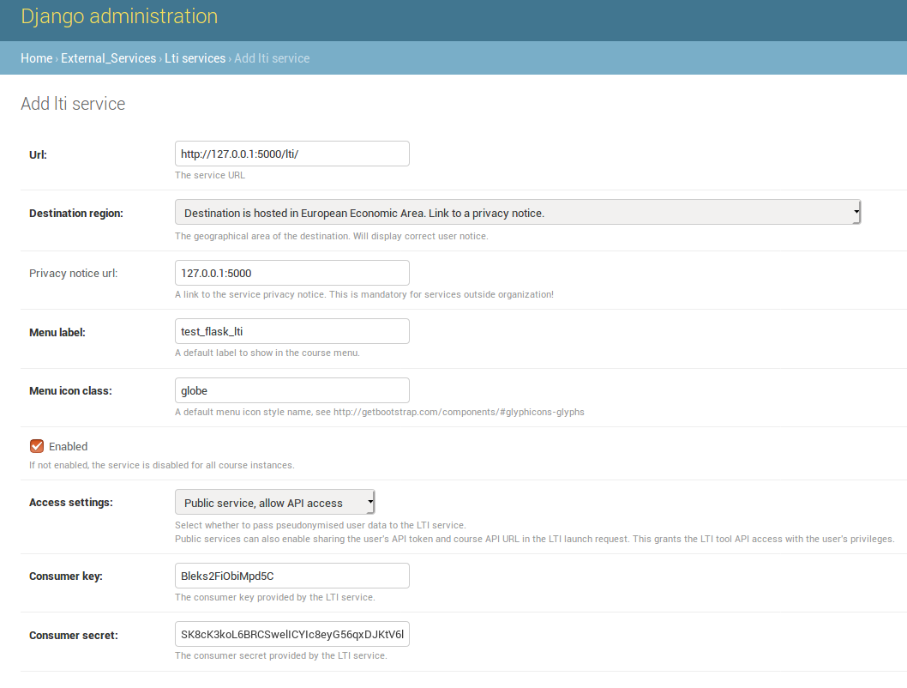

# The test docker image for [Shepherd](https://github.com/apluslms/shepherd)
*This image is only for testing shepherd, don't use it for production deployment.*

## Features
* Based on [apluslms-service-base](https://github.com/apluslms/service-base/).
* Start [Shepherd](https://github.com/apluslms/shepherd) in one go.
* Using [s6](https://github.com/skarnet/s6) for service supervision.
## User in container
* `shepherd`: used for run shepherd, celery, broker, etc.
* `postgresql`: used in the initialisation of database.

## S6 Services
* `shepherd-celery-beat`: run scheduled task, such as repo cleaning and RSA key auto-validation.
* `shepherd-celery-beat`: run other background task
* `shepherd-broker`: run message broker.

## Usage
### I. Prepare A+
1. Set up `A+` main server according to [here](https://apluslms.github.io/guides/quick/). 
2. Add lti service in [Django admin](http://127.0.0.1:8000/admin/external_services/ltiservice/add/).
This link only works after you run `A+` on the localhost 
3. Username and Password for A+: `root`.
4. The setting should be as same as this screenshot: Consumer Key: `Bleks2FiObiMpd5C`
Consumer secret `uf7OtOjcCclxGZBzzRoll87vledSK8cK3koL6BRCSwelICYIc8eyG56qxDJKtV6l`

3. Add lti service to menu, go to main page of `A+`, then go `Def. Course` -> `Edit course` -> Click `Menu` tab -> Add new menu item. Select `test_flask_lti` from `Service` and leave other empty.
4. Now you can see `test_flask_lti` on the left sidebar of the main page.
### II. Pull image and run.
1. `clone` this repository.
2. Check if the permission of `/var/run/docker.sock` allow other user to accesss, if not, change it with `sudo chmod o=rwx /var/run/docker.sock`, you need `sudo` privilege for this. 
3. Create `volume` for cloned files using `docker volume create shepherd_clone`. 
4. Run server using `docker build --no-cache -t shepherd . && docker run -p 5000:5000 -p 5001:5001 -v /var/run/docker.sock:/var/run/docker.sock -v shepherd_clone:/srv/shepherd/shepherd_test_clone/ shepherd:latest
`. 
5. Now you can use the system by click `test_flask_lti` on the the `A+`mian page. `LTI` protocal allows `A+` user log into `Shepherd` directly without passwords.
### III. Create your own course and test the course CI.
1. Create a group and assign yourself into the group.
2. Create a new repoistery in the GitLab, push A+ course template (the content of folder `my_new_course`) into the new repo. Copy the ssh address of the repo
3. Create a new course in the system, prefix should be match with the prefix in your group's setting. The repo adress should be the ssh address of the repoistery you created at step 2.
4. Go to "Repo" page, copy the auto generated deploy key, set it as the deploy key in your GitLab repo.
5. Now, when you push any change to your GitLab repo, the `Shepherd` will start clone and build your course, you can check real-time status and log on the build page.
